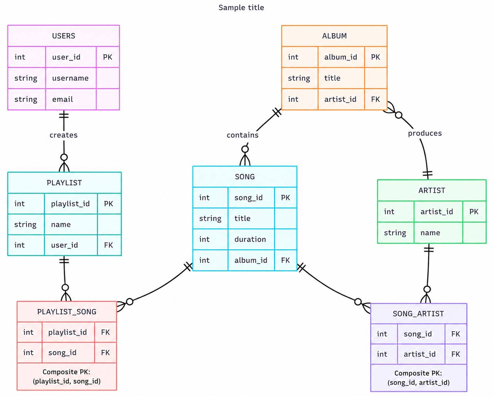

# Music Streaming Database

## Overview
A Database course project designing a relational database 
for a music streaming platform using Oracle.

## Tools Used
- Oracle Database
- SQL (DDL & DML)
- ERD Design

## What We Did
- Designed the full Entity-Relationship Diagram (ERD)
- Applied normalization to ensure 100% data integrity
- Created all tables and relationships using SQL

## ERD

## Team
- Nada Hashad (Team Leader)
- Rahma Refaay (Team Member)
- Hamza Hemeida (Team Member)
- Ahmed Moselhy (Team Member)
- Abdallah Sobhy (Team Member)

Menoufia National University, 2026
